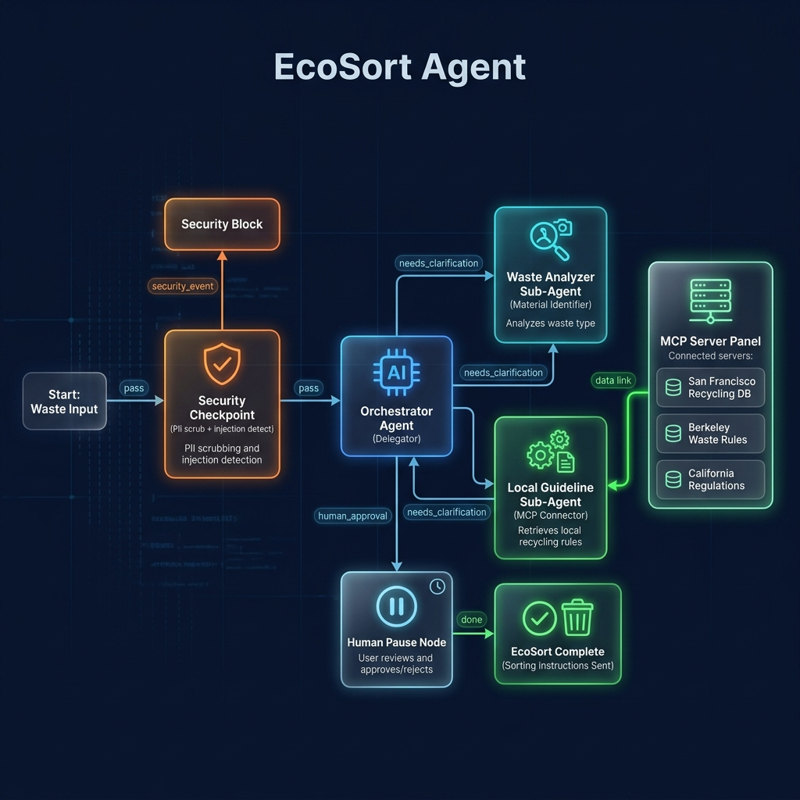

# EcoSort Agent: Submission Write-up

## Problem Statement
Municipal waste management varies drastically across cities and regions. What is highly recyclable in San Francisco might be deemed trash in a smaller town due to differing local facilities. This inconsistency creates widespread confusion for residents, leading to massive contamination in recycling streams and ultimately causing recyclable materials to end up in landfills. There is a real-world need for an intelligent system that not only identifies what a piece of waste is made of, but also dynamically cross-references the specific, hyper-local municipal rules for the user's jurisdiction.

## Solution Architecture

The EcoSort Agent solves this by utilizing a modular graph-based workflow built on the Google Agent Development Kit (ADK) 2.0. The system uses a centralized orchestrator to decompose the user's query and dispatch work to specialized sub-agents. 

## Concepts Used

- **ADK Workflow** (`app/agent.py`): The backbone of the system is the `Workflow` graph, featuring explicit definitions of nodes (`@node` decorators) and conditional routing (`edges`) to build a deterministic state machine.
- **LlmAgent & AgentTool** (`app/agent.py`): The `OrchestratorAgent` coordinates the `WasteAnalyzer` and `LocalGuidelineAgent`. These sub-agents are packaged as `AgentTool`s and supplied to the Orchestrator.
- **MCP Server** (`app/mcp_server.py`): The `LocalGuidelineAgent` has access to a local Model Context Protocol server that exposes a `get_municipal_guidelines` function. This abstracts the data retrieval layer away from the core agent prompts.
- **Security Checkpoint** (`app/agent.py`): A purely programmatic Python node that sits *in front* of all LLM execution.
- **Agents CLI**: Utilized to scaffold the initial environment, manage environment variables, and run the `make playground` interface.

## Security Design
To ensure safe enterprise-grade operation, the first node in the ADK workflow graph is a **Security Checkpoint**.
1. **Prompt Injection Detection**: Scans the incoming payload for adversarial terms ("ignore previous instructions", "override"). If found, the workflow short-circuits to the terminal output node and logs the attempt. This prevents bad actors from highjacking the agent's behavior.
2. **PII Scrubbing**: Automatically scrubs phone numbers using Regex, replacing them with `[REDACTED PHONE]`. This guarantees user privacy before data ever hits the Gemini API.
3. **Hazardous Waste Rules**: Immediately flags domain-specific hazards like syringes or batteries and outputs a critical safety warning, preventing the LLM from accidentally generating bad or hallucinatory advice on dangerous materials.

## MCP Server Design
The project features a dedicated MCP server running locally. It exposes the following capability:
- **`get_municipal_guidelines(city: str)`**: A tool that returns structured JSON sorting guidelines based on the provided city. By placing this behind an MCP server interface, the knowledge base can easily be swapped for a live database or API without changing any of the agent's core logic or tools.

## Human-in-the-Loop (HITL) Flow
Not all waste descriptions are clean. If a user simply inputs "Where does this shiny wrapper go?", the Orchestrator is instructed to output the flag `NEEDS_INFO`. The workflow routes this conditional edge to the **Human Pause Node**, which utilizes ADK's `RequestInput` capability. This suspends the workflow graph entirely, prompts the user for clarification in the playground interface, and safely resumes the state machine with the appended context once the human replies. This guarantees accuracy for ambiguous inputs.

## Demo Walkthrough

The following paths were verified during testing:
1. **Standard Routing**: Inputting *"I have an empty plastic water bottle and I live in San Francisco."* correctly engaged the Waste Analyzer and Local Guideline MCP tools to produce an accurate recommendation.
2. **HITL Triggered**: Inputting vague text correctly resulted in a UI pause where the agent asked: *"I need more details about the item you want to sort. Could you provide a clearer description?"*
3. **Security Short-circuit**: Inputting *"I need to throw away some old medical syringes and batteries."* immediately stopped the workflow and returned a hard-coded safety warning about hazardous waste, bypassing all LLMs.

## Impact / Value Statement
By decentralizing knowledge into local MCP servers and utilizing specialized sub-agents, EcoSort provides a hyper-scalable model for waste management. Residents benefit from accurate, real-time advice tailored to their exact zip code, while municipalities benefit from cleaner recycling streams and significantly reduced contamination processing costs. The strict security and HITL safeguards make it safe for public deployment.
